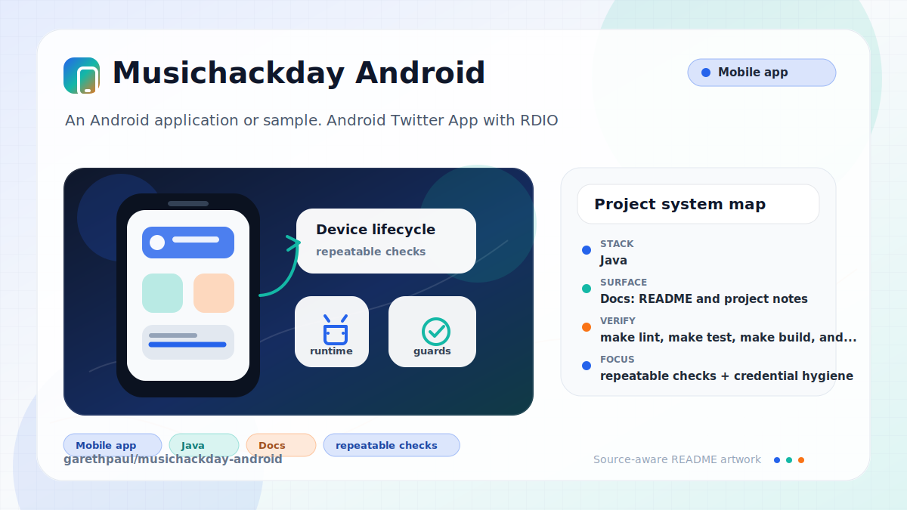

# musichackday-android

<!-- README-OVERVIEW-IMAGE -->


## Overview

`garethpaul/musichackday-android` is an Android application or sample. Android Twitter App with RDIO

This README is based on the checked-in source, manifests, scripts, and repository metadata on the `master` branch. The project language mix found during review was: Java (11).

## Repository Contents

- `README.md` - project overview and local usage notes
- `build.gradle` - Android or Gradle build configuration
- `app` - source or example code
- `gradle` - source or example code
- `gradlew` - Android or Gradle build configuration
- `SECURITY.md` - security reporting and disclosure guidance
- `VISION.md` - project direction and maintenance guardrails

Additional scan context:

- Source directories: app, gradle
- Dependency and build manifests: build.gradle, gradlew
- Entry points or build surfaces: Gradle build files
- Test-looking files: no obvious test files detected

## Getting Started

### Prerequisites

- Git
- Android Studio or a compatible Android SDK
- Gradle or the checked-in Gradle wrapper when present
- Legacy Android SDK Platform 19 and Build Tools 19.0.3 for full builds

### Setup

```bash
git clone https://github.com/garethpaul/musichackday-android.git
cd musichackday-android
make lint
make test
make build
make check
```

The setup commands above are derived from repository files. Legacy mobile, Python, or JavaScript samples may require older SDKs or package versions than a modern workstation uses by default.

## Running or Using the Project

- Use Android Studio to open the project or run `./gradlew assembleDebug` when the Android SDK is configured.
- Copy `app/src/main/java/com/twitterdev/rdio/app/Constants.java.example` to
  `app/src/main/java/com/twitterdev/rdio/app/Constants.java` and fill in local
  Twitter/Rdio credentials before running authentication flows.

## Testing and Verification

- `make lint`, `make test`, `make build`, and `make check` run the SDK-free
  static Android baseline.
- Pinned `ubuntu-24.04` GitHub Actions runs the same baseline on Python 3.12
  without credentials, OAuth exchange, media downloads, Android SDK setup, or
  execution of the obsolete Gradle build.
- `./gradlew test` or Android Studio's test runner when the SDK is configured

The Make gates are SDK-free and intended for quick baseline verification on
modern machines. When the required SDK or runtime is unavailable, use static
checks and source review first, then verify on a machine that has the matching
platform toolchain.
The static check guards credential placeholders, token logging, verbose image
loader logging, manifest backup, legacy dependency pinning, executable wrapper
permissions, image download guards, and HTTPS Gradle wrapper downloads.

## Configuration and Secrets

- Detected references to Twitter. Keep API keys, OAuth credentials, tokens, and account-specific values in local configuration only.
- `Constants.java` is intentionally ignored. Commit only
  `Constants.java.example`, and keep the placeholder values obviously fake.
- Image cache entries use SHA-256 cache filenames derived from media URLs while
  staying inside the app-private cache directory.
- Image download guards should keep invalid media URLs and recycled row image views from reaching Universal Image Loader.
- The HTTP image URL guard should keep non-HTTP(S) media references out of image loading.
- The HTTPS profile image guard selects Twitter's encrypted profile-image URL
  and rejects cleartext HTTP again at the loader boundary.
- Memory cache entry guards prune cleared soft references and skip null cache writes.
- The OAuth callback URI guard accepts only the configured callback scheme and
  authority before exchanging Twitter verifier values.
- The OAuth callback path guard rejects callback URLs whose path differs from
  the configured callback before exchanging Twitter verifier values.
- The OAuth callback verifier guard rejects missing or blank verifier values
  before requesting Twitter access tokens.
- The OAuth callback token guard requires callback tokens to match the active
  request token before exchanging Twitter verifier values.
- Sanitized OAuth error logging keeps Twitter login failures at action-level
  messages without exception details or stack traces.
- Local editor metadata stays ignored so Android Studio and VS Code workspace
  files do not become part of the shared verification baseline.

## Security and Privacy Notes

- Review changes touching authentication or token handling; examples from the scan include app/src/main/java/com/twitterdev/rdio/app/MainActivity.java, app/src/main/java/com/twitterdev/rdio/app/RdioApp.java, app/src/main/res/layout/activity_main.xml.
- Review changes touching external API calls or credential-adjacent configuration; examples from the scan include app/src/main/AndroidManifest.xml, app/src/main/java/com/twitterdev/rdio/app/MainActivity.java, app/src/main/java/com/twitterdev/rdio/app/RdioApp.java.
- Review changes touching network requests, sockets, or service endpoints; examples from the scan include app/proguard-rules.txt, app/src/main/AndroidManifest.xml, app/src/main/java/com/twitterdev/rdio/app/RdioApp.java, app/src/main/res/drawable/rdio_gradient.xml, and 6 more.
- Review changes touching mobile permissions or privacy-sensitive device data; examples from the scan include app/src/main/AndroidManifest.xml, app/src/main/java/com/twitterdev/rdio/app/RdioApp.java, gradlew.
- Review changes touching file, media, JSON, XML, CSV, OCR, or data parsing; examples from the scan include app/build.gradle, app/src/main/AndroidManifest.xml, app/src/main/java/com/twitterdev/rdio/app/ImageDownload.java, app/src/main/java/com/twitterdev/rdio/app/MainActivity.java, and 6 more.
- Keep image download guards in place because media URLs and row image views are transient in scrolling lists.
- Keep the HTTP image URL guard in place so local or non-web URI schemes are not loaded as remote media.
- Keep the HTTPS profile image guard in place so profile media cannot fall back
  to cleartext HTTP transport.
- Keep the OAuth callback URI guard in place so only the configured callback
  endpoint resumes Twitter login.
- Keep the OAuth callback path guard in place so lookalike callback paths do
  not resume Twitter login.
- Keep the OAuth callback verifier guard in place so malformed callback intents
  cannot trigger a token exchange.
- Keep the OAuth callback token guard in place so callbacks for another request
  token cannot resume the local Twitter login.
- Keep sanitized OAuth error logging in place so failed Twitter login attempts
  do not write provider exception details to Android logs.
- Review changes touching database, model, or persistence code; examples from the scan include app/src/main/java/com/twitterdev/rdio/app/RdioApp.java.

## Maintenance Notes

- This looks like a legacy Android project or sample. Expect Android SDK, Gradle, and support-library versions to matter.
- Run `make lint`, `make test`, `make build`, and `make check` before pushing
  Gradle, credential-template, manifest, logging, or documentation changes.
- See `docs/plans/2026-06-09-make-gate-aliases.md` for the local gate alias
  baseline.
- See `docs/plans/2026-06-09-sanitized-oauth-error-logging.md` for the
  sanitized OAuth error logging guardrail.
- See `docs/plans/2026-06-09-editor-metadata-ignore.md` for the local editor
  metadata guardrail.
- See `SECURITY.md` for vulnerability reporting and safe research guidance.
- See `VISION.md` for project direction and contribution guardrails.

## Contributing

Keep changes small and tied to the project that is already present in this repository. For code changes, document the toolchain used, avoid committing generated dependency directories or local configuration, and update this README when setup or verification steps change.
